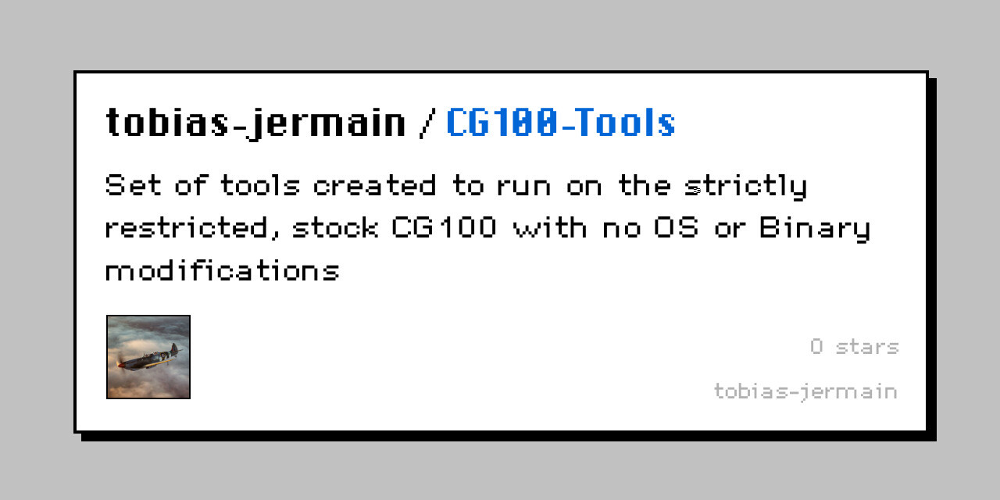

<div align="center">

# 🧮 CG100 Tools

### Games and tools for the **Casio fx-CG100**




*Small programs, written to fit and run on the fx-CG100 without modifying the binaries/OS..*

</div>

---

## 📦 Programs

| Program | Type | Description |
|---|---|---|
| [🟡 **PAC-MAN**](pacman/description.md) | 🎮 Game | Pac-Man style arcade game with four ghosts, power pellets, fruit and endless levels |
| [🐤 **Flappy Bird**](flappybird/description.md) | 🎮 Game | Flappy Bird clone with animated bird, scrolling scenery, medals and rising difficulty |
| [🧩 **Template**](template/description.md) | 🛠️ Starter | Blank starting point for a new program: copy it and rename |

Each program has its own folder containing the code and a `description.md` that explains what it does and how to use it.

## 🚀 Getting started

1. **Download** the `.py` file from the program's folder.
2. **Copy** it to your calculator.
3. **Open** it in the Python app and run it.

## 🗂️ Repository layout

```text
CG100-Tools/
├── README.md
├── CONTRIBUTING.md
├── template/
│   ├── template.py
│   └── description.md
├── pacman/
│   ├── pacman.py
│   └── description.md
└── flappybird/
    ├── flappybird.py
    └── description.md
```

New programs follow the same pattern: one folder per program, with the code and a `description.md`. Start by copying the [`template/`](template/description.md) folder.

## ⚙️ Requirements

- Casio **fx-CG100**
- MicroPython **1.9.4** with the `casioplot` module
- Programs of at most **300 lines** (the calculator's limit)

## 📝 Notes

- Programs are written compactly, with short names and little whitespace, to keep memory use low.
- Games often have a speed setting near the top of the file, such as `SPD` in PAC-MAN. Change it if a game runs too fast or too slow.

## 🤝 Contributing

Want to add a game or tool? Read [CONTRIBUTING.md](CONTRIBUTING.md) for branch naming, commit style and how to structure a program.
